# Patient Advocacy Platform: Technical Architecture Overview

## Introduction

This document outlines the technical architecture for the Patient Advocacy Platform, a modern web application built with React and Vite. The architecture is designed to ensure scalability, maintainability, security, and optimal performance while providing a comprehensive set of features for patient advocacy.

```mermaid
graph TD
    A[Patient Advocacy Platform] --> B[Frontend Architecture]
    A --> C[Backend Architecture]
    A --> D[Data Architecture]
    A --> E[Integration Architecture]
    A --> F[Security Architecture]
    
    B --> B1[React Components]
    B --> B2[State Management]
    B --> B3[Routing]
    B --> B4[UI/UX Framework]
    
    C --> C1[API Services]
    C --> C2[Authentication]
    C --> C3[Business Logic]
    C --> C4[Background Processing]
    
    D --> D1[Database Design]
    D --> D2[Data Access Layer]
    D --> D3[Caching Strategy]
    
    E --> E1[EHR Integration]
    E --> E2[Insurance APIs]
    E --> E3[Telehealth Services]
    
    F --> F1[Authentication]
    F --> F2[Authorization]
    F --> F3[Data Protection]
    F --> F4[Compliance]
```

## Technology Stack

### Frontend
- **Framework**: React 18+
- **Build Tool**: Vite
- **State Management**: Redux Toolkit with RTK Query
- **UI Framework**: Material UI
- **Data Visualization**: D3.js and Chart.js
- **Form Management**: React Hook Form with Zod validation
- **Styling**: Emotion/styled-components with a custom theme
- **Testing**: Jest, Testing Library, and Cypress
- **Internationalization**: react-i18next

### Backend
- **API Framework**: Node.js with Express or NestJS
- **Database**: PostgreSQL for relational data
- **Document Storage**: MongoDB for unstructured document data
- **Search Engine**: Elasticsearch for powerful search capabilities
- **Caching**: Redis for performance optimization
- **Authentication**: OAuth 2.0 / OpenID Connect, JWT
- **API Documentation**: Swagger / OpenAPI
- **Background Jobs**: Bull with Redis

### DevOps & Infrastructure
- **CI/CD**: GitHub Actions
- **Containerization**: Docker and Docker Compose
- **Hosting**: AWS or Azure Cloud Services
- **Monitoring**: Prometheus and Grafana
- **Logging**: ELK Stack (Elasticsearch, Logstash, Kibana)
- **CDN**: Cloudflare or AWS CloudFront
