# Backend Architecture

## Overview

The Patient Advocacy Platform backend is designed to provide secure, scalable, and maintainable API services that support the frontend application. The architecture employs modern practices for API development, authentication, data management, and integration with external services.

```mermaid
graph TD
    A[Backend Architecture] --> B[API Layer]
    A --> C[Service Layer]
    A --> D[Data Access Layer]
    A --> E[External Integrations]
    A --> F[Security Infrastructure]
    
    B --> B1[REST Endpoints]
    B --> B2[GraphQL Schema]
    B --> B3[API Documentation]
    B --> B4[Rate Limiting]
    
    C --> C1[Business Logic]
    C --> C2[Validation]
    C --> C3[Caching]
    C --> C4[Background Jobs]
    
    D --> D1[ORM/ODM]
    D --> D2[Query Optimization]
    D --> D3[Transaction Management]
    D --> D4[Data Migration]
    
    E --> E1[EHR Systems]
    E --> E2[Insurance APIs]
    E --> E3[Payment Gateways]
    E --> E4[Authentication Providers]
    
    F --> F1[Authentication]
    F --> F2[Authorization]
    F --> F3[Data Encryption]
    F --> F4[Audit Logging]
```



## API Architecture

The API is built using a RESTful architecture with clearly defined resources and operations:

### API Design Principles

1. **Resource-Oriented**: APIs organized around resources (patients, cases, documents)
2. **Consistent Endpoints**: Predictable patterns for CRUD operations
3. **Versioning**: API versioning to ensure backward compatibility
4. **Clear Documentation**: Comprehensive Swagger/OpenAPI documentation

### Endpoint Structure

```
/api/v1/
├── auth/                   # Authentication endpoints
│   ├── login               # Login endpoint
│   ├── refresh-token       # Token refresh
│   └── logout              # Logout endpoint
├── patients/               # Patient resource
│   ├── /                   # List and create
│   └── /:id                # Get, update, delete
├── cases/                  # Case management
│   ├── /                   # List and create
│   ├── /:id                # Get, update, delete
│   └── /:id/notes          # Case notes
├── documents/              # Document management
│   ├── /                   # List and create
│   ├── /:id                # Get, update, delete
│   └── /:id/share          # Sharing functionality
└── ...                     # Other resources
```

## Service Layer Architecture

The service layer contains the business logic and orchestrates operations between the API layer and data access layer:

### Service Organization

Services are organized by domain and follow the single responsibility principle:

```javascript
// Example Patient Service
class PatientService {
  async getPatients(filters) {
    // Business logic for retrieving patients
    // Apply filtering, permissions, etc.
    return this.patientRepository.findAll(filters);
  }
  
  async createPatient(patientData) {
    // Validate data
    // Apply business rules
    // Store data
    return this.patientRepository.create(patientData);
  }
  
  // Other patient-related operations
}
```
