# Frontend Architecture

## Overview

The Patient Advocacy Platform frontend is built using React with Vite as the build tool, providing a modern, performant, and maintainable user interface. This document details the frontend architecture decisions, component structure, and development practices.

```mermaid
graph TD
    A[Frontend Architecture] --> B[Component Architecture]
    A --> C[State Management]
    A --> D[Routing Architecture]
    A --> E[UI/UX Framework]
    A --> F[Performance Optimizations]
    
    B --> B1[Atomic Design]
    B --> B2[Component Hierarchy]
    B --> B3[Component Lifecycle]
    
    C --> C1[Redux Store]
    C --> C2[RTK Query]
    C --> C3[Local Component State]
    C --> C4[Context API Usage]
    
    D --> D1[React Router]
    D --> D2[Route Protection]
    D --> D3[Lazy Loading]
    
    E --> E1[Material UI]
    E --> E2[Theming System]
    E --> E3[Responsive Design]
    E --> E4[Accessibility]
    
    F --> F1[Code Splitting]
    F --> F2[Memoization]
    F --> F3[Bundle Optimization]
```



## Component Architecture

The frontend follows the Atomic Design methodology to create a scalable and maintainable component structure:

### Component Hierarchy

1. **Atoms**: Basic building blocks (buttons, inputs, icons)
2. **Molecules**: Simple combinations of atoms (form fields, search bars)
3. **Organisms**: Complex UI sections (navigation bars, dashboards, forms)
4. **Templates**: Page layouts without specific content
5. **Pages**: Complete views with actual content

### Directory Structure

```
src/
├── assets/            # Static assets like images, fonts
├── components/        # Shared components
│   ├── atoms/         # Basic UI elements
│   ├── molecules/     # Combined atoms
│   ├── organisms/     # Complex components
│   └── templates/     # Page layouts
├── features/          # Feature-based modules
│   ├── auth/          # Authentication related
│   ├── dashboard/     # Dashboard components
│   ├── caseManagement/# Case management features
│   └── ...            # Other features
├── hooks/             # Custom React hooks
├── pages/             # Page components
├── services/          # API and other services
├── store/             # Redux store configuration
├── styles/            # Global styles and themes
├── utils/             # Utility functions
├── App.jsx            # Main App component
└── main.jsx           # Entry point
```

## State Management

The application uses a combination of state management approaches:

### Redux Store with Redux Toolkit

The global application state is managed with Redux Toolkit, organized by feature slices:

```javascript
// Example slice structure
const caseSlice = createSlice({
  name: 'cases',
  initialState,
  reducers: {
    setCases: (state, action) => {
      state.cases = action.payload;
    },
    addCase: (state, action) => {
      state.cases.push(action.payload);
    },
    // Other case-related reducers
  },
  extraReducers: (builder) => {
    // Handle async actions
  }
});
```

### RTK Query for API Integration

API calls and data fetching are handled through RTK Query:

```javascript
// Example API slice
export const apiSlice = createApi({
  reducerPath: 'api',
  baseQuery: fetchBaseQuery({ baseUrl: '/api' }),
  tagTypes: ['Cases', 'Patients', 'Documents'],
  endpoints: (builder) => ({
    getCases: builder.query({
      query: () => 'cases',
      providesTags: ['Cases']
    }),
    addNewCase: builder.mutation({
      query: (newCase) => ({
        url: 'cases',
        method: 'POST',
        body: newCase
      }),
      invalidatesTags: ['Cases']
    }),
    // Other endpoints
  })
});
```
