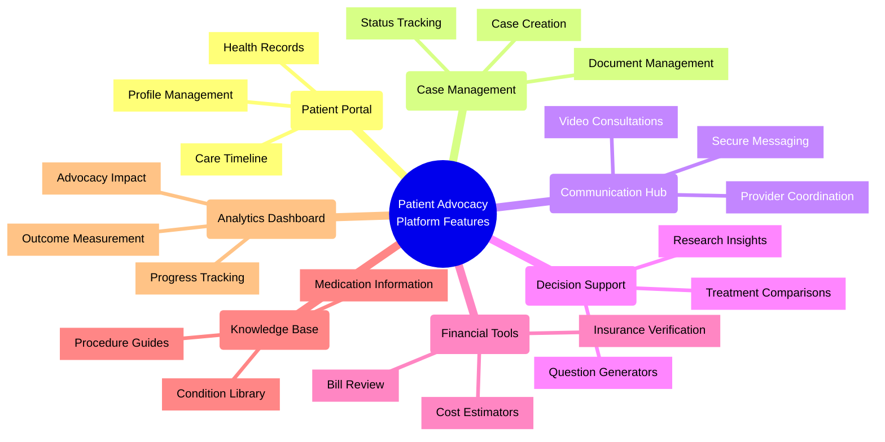

# Core Features

## Overview

This document outlines the core features of the Patient Advocacy Platform, detailing the specific functionality that will be implemented in the React Vite application. These features directly address the patient needs and market gaps identified in our research.

## 1. Patient Portal

The central hub for patients to manage their healthcare information and advocacy needs:

### Profile Management
- **Comprehensive Profiles**: Detailed patient profiles with medical history, medications, allergies, and preferences
- **Multiple Patient Management**: Support for managing advocacy for multiple family members
- **Preference Settings**: Customization options for notifications, privacy settings, and display preferences
- **Accessibility Features**: Font size adjustments, screen reader compatibility, and high contrast modes

### Health Records
- **Medical History Repository**: Secure storage for all health-related documents and history
- **Document Upload**: Easy upload of medical records, test results, and other health documents
- **OCR Processing**: Automatic extraction of key information from uploaded documents
- **Record Organization**: Chronological and categorical organization of health records

### Care Timeline
- **Visual Timeline**: Interactive visualization of healthcare journey and advocacy milestones
- **Appointment Tracking**: Calendar integration for upcoming and past appointments
- **Treatment History**: Chronological view of treatments, medications, and procedures
- **Milestone Recording**: Documentation of key healthcare events and outcomes
