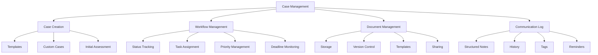

# Core Features (Continued)

## 2. Case Management

A comprehensive system for tracking and managing advocacy cases:

### Case Creation and Workflow
- **Case Templates**: Pre-configured templates for common advocacy scenarios
- **Custom Case Types**: Ability to create custom case types for specific needs
- **Status Tracking**: Clearly defined statuses with visual indicators
- **Task Assignment**: Assignment of tasks to patients, advocates, or family members
- **Priority Levels**: Designation of high, medium, and low priority cases

### Document Management
- **Secure Document Storage**: HIPAA-compliant storage for case-related documents
- **Version Control**: Tracking of document versions and changes
- **Document Sharing**: Secure sharing with providers and family members
- **Document Templates**: Pre-built templates for common documentation needs
- **Digital Signatures**: Support for electronic signatures on documents

### Notes and Communication Log
- **Structured Notes**: Template-based notes for consistency
- **Communication History**: Chronological log of all case-related communications
- **Voice Notes**: Support for audio recording of notes
- **Tagging System**: Categorization of notes for easy reference
- **Follow-up Reminders**: Automated reminders for required follow-up actions

## 3. Communication Hub

A central platform for secure communication between patients, advocates, providers, and family members:

### Secure Messaging
- **End-to-End Encryption**: Secure messaging that meets HIPAA requirements
- **Provider Directory**: Easily accessible directory of healthcare providers
- **Template Messages**: Pre-built templates for common communications
- **Multi-party Messaging**: Support for group conversations with care teams
- **Attachment Support**: Secure sharing of documents, images, and other files

### Video Consultations
- **Integrated Telehealth**: HIPAA-compliant video conferencing for virtual meetings
- **Screen Sharing**: Ability to share screens for reviewing documents
- **Recording Options**: Option to record sessions with proper consent
- **Calendar Integration**: Seamless scheduling with calendar applications
- **Waiting Room**: Virtual waiting room for scheduled consultations
