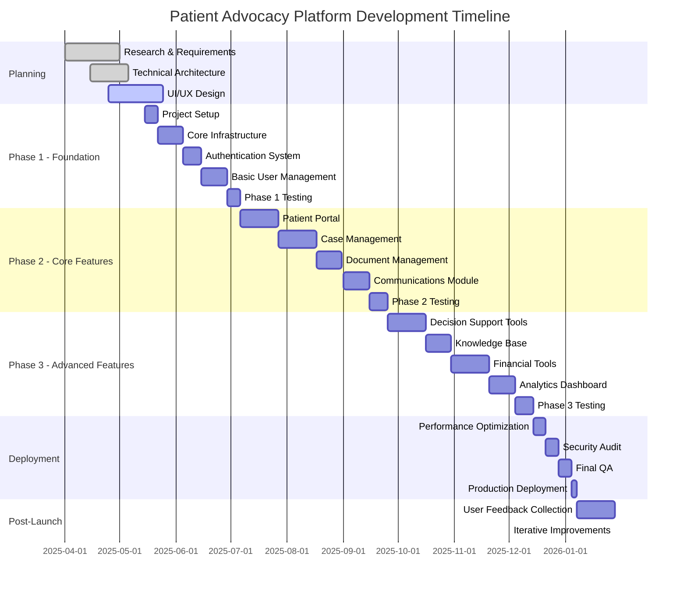

# Development Timeline

## Overview

This document outlines the phased development approach for the Patient Advocacy Platform. The timeline is organized into distinct phases with specific milestones and deliverables for each phase.

## Phase 1: Foundation (8 Weeks)

The initial phase focuses on establishing the core technical infrastructure and basic functionality.

### Milestones

1. **Project Setup (Week 1)**
   - Initialize React Vite project
   - Configure development environment
   - Set up CI/CD pipeline
   - Implement code quality tools

2. **Core Infrastructure (Weeks 2-3)**
   - Implement routing architecture
   - Set up state management
   - Create component library foundation
   - Establish API communication layer

3. **Authentication System (Weeks 4-5)**
   - Develop login and registration
   - Implement JWT authentication
   - Create password reset flow
   - Set up role-based access control

4. **Basic User Management (Weeks 6-7)**
   - Implement user profiles
   - Create user settings
   - Develop notification preferences
   - Set up multi-profile management

5. **Phase 1 Testing (Week 8)**
   - Unit and integration testing
   - User acceptance testing
   - Performance testing
   - Security testing
