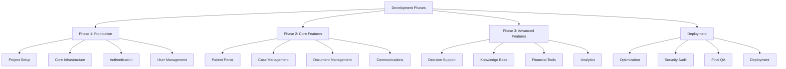

# Development Timeline (Continued)

## Phase 2: Core Features (10 Weeks)

Phase 2 focuses on implementing the core functionality that delivers the primary value of the platform.

### Milestones

1. **Patient Portal (Weeks 9-11)**
   - Develop health profile management
   - Implement medical history repository
   - Create care timeline visualization
   - Build appointment tracking system
   - Implement accessibility features

2. **Case Management (Weeks 12-14)**
   - Develop case creation workflow
   - Implement case status tracking
   - Create task management system
   - Build priority management
   - Implement deadline tracking

3. **Document Management (Weeks 15-16)**
   - Develop document upload system
   - Implement OCR processing
   - Create document categorization
   - Build version control
   - Implement secure sharing

4. **Communications Module (Weeks 17-18)**
   - Develop secure messaging system
   - Implement provider directory
   - Create message templates
   - Build notification system
   - Implement video consultation capabilities

5. **Phase 2 Testing (Week 19)**
   - Comprehensive feature testing
   - Integration testing
   - Performance optimization
   - User acceptance testing

## Phase 3: Advanced Features (11 Weeks)

Phase 3 adds sophisticated features that differentiate the platform and provide advanced capabilities.

### Milestones

1. **Decision Support Tools (Weeks 20-22)**
   - Develop treatment comparison tools
   - Implement question generators
   - Create decision documentation system
   - Build provider recommendation engine
   - Implement consent documentation

2. **Knowledge Base (Weeks 23-24)**
   - Develop condition library
   - Create procedure guides
   - Implement medication information database
   - Build research updates system
   - Create terminology translator

3. **Financial Tools (Weeks 25-27)**
   - Develop insurance verification system
   - Implement cost estimator tools
   - Create bill review and analysis
   - Build financial assistance finder
   - Implement payment tracking

4. **Analytics Dashboard (Weeks 28-29)**
   - Develop progress tracking visualizations
   - Implement outcome measurement tools
   - Create advocacy impact metrics
   - Build personalized insights
   - Implement reporting system

5. **Phase 3 Testing (Weeks 30-31)**
   - Advanced feature testing
   - Comprehensive system testing
   - Performance optimization
   - User acceptance testing
   - Accessibility compliance testing

