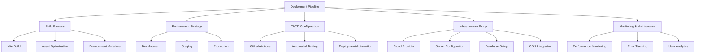

# Deployment Strategies

## Overview

This document outlines the deployment strategies for the Patient Advocacy Platform. It covers the build process, deployment environments, CI/CD pipeline, and infrastructure recommendations for optimal performance and security.



## 1. Build Process

### Vite Production Build

The React Vite application is built using the following process:

```bash
# Production build
npm run build

# Preview build locally
npm run preview
```

The build process:
1. Transpiles TypeScript to JavaScript
2. Bundles modules with optimizations
3. Minifies code and assets
4. Tree-shakes unused code
5. Generates chunk hashing for cache control
6. Processes and optimizes CSS

### Output Configuration

The Vite build output is configured in `vite.config.ts`:

```typescript
// Example configuration
export default defineConfig({
  plugins: [react()],
  build: {
    outDir: 'dist',
    assetsDir: 'assets',
    sourcemap: false, // Set to true for debugging production issues
    minify: 'terser',
    terserOptions: {
      compress: {
        drop_console: true,
      },
    },
    rollupOptions: {
      output: {
        manualChunks: {
          vendor: ['react', 'react-dom', 'react-router-dom'],
          ui: ['@mui/material', '@emotion/react', '@emotion/styled'],
          charts: ['chart.js', 'd3'],
        },
      },
    },
  },
});
```

## 2. Deployment Environments

### Environment Strategy

The platform utilizes three distinct environments:

1. **Development**
   - Purpose: Active development and testing
   - URL: dev.patientadvocacyplatform.org
   - Features: Full debugging, non-minified code, mock data

2. **Staging**
   - Purpose: Pre-production testing and QA
   - URL: staging.patientadvocacyplatform.org
   - Features: Production-like environment, test data, feature flags

3. **Production**
   - Purpose: Live user access
   - URL: patientadvocacyplatform.org
   - Features: Optimized performance, real data, monitoring
