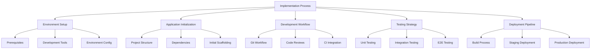

# Implementation Guide: Patient Advocacy Platform

## Overview

This guide provides detailed instructions for implementing the Patient Advocacy Platform using React and Vite. It covers the initial setup, development environment, coding standards, and best practices for successful implementation.



## 1. Environment Setup

### Prerequisites
- Node.js >= 18.x
- npm >= 9.x or Yarn >= 1.22.x
- Git
- VS Code or preferred IDE

### Development Tools Setup
- Install recommended VS Code extensions:
  - ESLint
  - Prettier
  - Vite
  - React Developer Tools
  - GitHub Copilot (optional)

### Environment Configuration
- Set up `.env` files for different environments:
  ```
  .env.development
  .env.test
  .env.production
  ```

## 2. Project Initialization

### Creating a New Vite React Project
```bash
# Using npm
npm create vite@latest patient-advocacy-platform -- --template react-ts

# Using Yarn
yarn create vite patient-advocacy-platform --template react-ts

cd patient-advocacy-platform
```

### Project Structure
```
/
├── public/                 # Static files
├── src/
│   ├── assets/             # Images, fonts, etc.
│   ├── components/         # Shared UI components
│   ├── features/           # Feature-based code organization
│   ├── hooks/              # Custom React hooks
│   ├── pages/              # Page components
│   ├── services/           # API and other services
│   ├── store/              # State management
│   ├── styles/             # Global styles
│   ├── types/              # TypeScript type definitions
│   ├── utils/              # Utility functions
│   ├── App.tsx             # Main App component
│   ├── main.tsx            # Entry point
│   └── vite-env.d.ts       # Vite environment types
├── .eslintrc.cjs           # ESLint configuration
├── .gitignore              # Git ignore file
├── .prettierrc             # Prettier configuration
├── index.html              # HTML template
├── package.json            # Dependencies and scripts
├── tsconfig.json           # TypeScript configuration
└── vite.config.ts          # Vite configuration
```
