# Maintenance Guidelines

## Overview

This document outlines the maintenance procedures and best practices for ensuring the long-term stability, security, and performance of the Patient Advocacy Platform. It provides guidelines for routine maintenance, monitoring, updates, and troubleshooting.

```mermaid
flowchart TD
    A[Maintenance Strategy] --> B[Routine Maintenance]
    A --> C[Monitoring Systems]
    A --> D[Update Management]
    A --> E[Backup & Recovery]
    A --> F[Security Maintenance]
    
    B --> B1[Daily Checks]
    B --> B2[Weekly Tasks]
    B --> B3[Monthly Activities]
    B --> B4[Quarterly Reviews]
    
    C --> C1[Performance Monitoring]
    C --> C2[Error Tracking]
    C --> C3[Usage Analytics]
    C --> C4[Security Monitoring]
    
    D --> D1[Dependency Updates]
    D --> D2[Feature Updates]
    D --> D3[Security Patches]
    D --> D4[Release Management]
    
    E --> E1[Backup Strategy]
    E --> E2[Restoration Testing]
    E --> E3[Disaster Recovery]
    
    F --> F1[Vulnerability Scanning]
    F --> F2[Penetration Testing]
    F --> F3[Compliance Audits]
```

## 1. Routine Maintenance Schedule

### Daily Maintenance
- **System Health Checks**
  - Monitor API response times
  - Check error logs for unusual activity
  - Verify database connections and performance
  - Ensure all services are running properly

- **Security Monitoring**
  - Review authentication logs for suspicious activity
  - Monitor for unusual access patterns
  - Check for failed login attempts

### Weekly Maintenance
- **Performance Analysis**
  - Review performance metrics and identify bottlenecks
  - Analyze slow-performing queries and optimize
  - Check frontend loading times across various devices

- **Error Resolution**
  - Address non-critical errors identified during the week
  - Update error tracking systems with resolutions
  - Document recurring issues for deeper investigation

### Monthly Maintenance
- **Dependency Updates**
  - Review and update npm packages with security fixes
  - Test application after dependency updates
  - Document all updates in the maintenance log

- **Feature Enhancement Review**
  - Analyze feature usage metrics
  - Identify underperforming features for improvement
  - Prioritize enhancement requests from users
