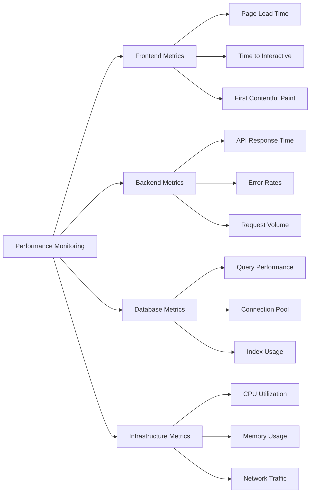

# Maintenance Guidelines (Continued)

## 1. Routine Maintenance Schedule (Continued)

### Quarterly Maintenance
- **Comprehensive Security Audit**
  - Conduct vulnerability scanning
  - Review permission structures and access controls
  - Assess compliance with healthcare regulations
  - Update security certificates if needed

- **Performance Optimization**
  - Conduct full-system performance testing
  - Optimize database queries and indexes
  - Review and improve API response times
  - Enhance frontend loading and rendering performance

- **Database Maintenance**
  - Run database cleanup procedures
  - Archive older, less-accessed data
  - Reindex databases for optimal performance
  - Verify backup integrity with restoration tests

### Annual Maintenance
- **Technology Stack Review**
  - Evaluate current technology stack against industry standards
  - Plan for major version upgrades
  - Assess need for architectural improvements
  - Review third-party service providers

- **Comprehensive User Feedback Analysis**
  - Analyze support tickets for systemic issues
  - Review user feedback for improvement opportunities
  - Update feature roadmap based on user needs
  - Plan major enhancements for the coming year

## 2. Monitoring Systems

### Performance Monitoring
- **Key Metrics to Track**
  - API response times (target: < 200ms)
  - Page load times (target: < 2 seconds)
  - Database query performance (identify queries taking > 100ms)
  - Memory and CPU utilization
  
- **Monitoring Tools**
  - New Relic for application performance monitoring
  - Datadog for infrastructure monitoring
  - Lighthouse for frontend performance
  - Custom performance dashboards

### Error Tracking

- **Error Management Approach**
  - Automatic error categorization and prioritization
  - Real-time alerts for critical errors
  - Error trending and pattern recognition
  - Root cause analysis workflow

- **Error Tracking Tools**
  - Sentry for real-time error tracking
  - LogRocket for session replay of errors
  - Custom error dashboards in monitoring systems
  - Error tracking integrated with ticketing system
