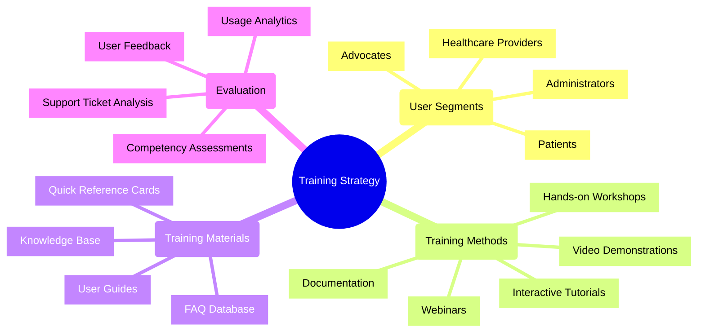

# Training Plan: Patient Advocacy Platform

## Overview

This document outlines the comprehensive training strategy for different user groups of the Patient Advocacy Platform. It includes training methodologies, resources, and evaluation approaches to ensure effective platform adoption.

## User Segments and Training Needs

### 1. Patients and Family Members

**Learning Objectives:**
- Navigate the patient portal effectively
- Manage health records and documents
- Communicate with advocates and providers
- Use decision support tools
- Access and utilize the knowledge base

**Training Approach:**
- Short, focused video tutorials (2-5 minutes each)
- Interactive guided tours within the application
- Printable quick reference guides
- Community support forums

### 2. Professional Advocates

**Learning Objectives:**
- Master case management workflows
- Utilize communication tools effectively
- Navigate the document management system
- Leverage analytics for client support
- Implement best practices for advocacy

**Training Approach:**
- Comprehensive certification program
- In-depth webinars with Q&A sessions
- Advanced workflow demonstrations
- Case study-based learning
- Peer learning communities
