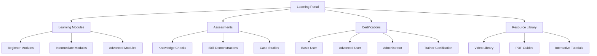

# Training Plan: Patient Advocacy Platform (Continued)

## User Segments and Training Needs (Continued)

### 3. Healthcare Providers

**Learning Objectives:**
- Access and contribute to patient advocacy cases
- Utilize secure communication channels
- Navigate shared documentation
- Participate in collaborative care planning
- Understand advocacy workflows

**Training Approach:**
- Integration with continuing education programs
- Concise workflow demonstrations (under 10 minutes)
- Role-specific quick guides
- Just-in-time learning prompts within the platform
- Integration tutorials for EHR systems

### 4. System Administrators

**Learning Objectives:**
- Configure and customize the platform
- Manage user roles and permissions
- Implement security best practices
- Generate and analyze system reports
- Perform basic troubleshooting

**Training Approach:**
- Comprehensive technical documentation
- Hands-on administration workshops
- Configuration walkthrough videos
- Administrative console tutorials
- Advanced troubleshooting guides

## Training Delivery Methods

### Online Learning Portal

A dedicated learning management system will provide:

- Self-paced learning modules
- Progress tracking
- Competency assessments
- Certifications
- Training material updates

### Webinars and Live Training

Regular live training sessions to support implementation:

- Weekly orientation webinars
- Monthly feature deep-dives
- Quarterly best practices sessions
- Special topic workshops based on user feedback
- Train-the-trainer sessions for organizational champions
