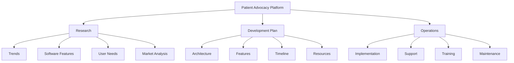

# Patient Advocacy Platform

A comprehensive software platform for patient advocacy, designed to empower patients, healthcare advocates, and providers with the latest tools and technologies.

## Repository Overview

This repository contains extensive research, development plans, and operational guidelines for building a state-of-the-art patient advocacy software platform that addresses the emerging trends of 2024-2025.

## Key Components

### Research
- **Trends**: Current and future trends in patient advocacy for 2024-2025
- **Software Features**: Essential and innovative features for patient advocacy platforms
- **User Needs**: Research on the needs of patients, advocates, and healthcare providers
- **Market Analysis**: Analysis of the current market and competition

### Development Plan
- **Architecture**: Technical architecture and system design
- **Features**: Detailed feature specifications and requirements
- **Timeline**: Development roadmap and milestones
- **Resources**: Required resources and technology stack

### Operations
- **Implementation**: Guidelines for implementing the platform
- **Support**: Support systems and processes
- **Training**: Training materials and methodologies
- **Maintenance**: Maintenance procedures and guidelines

## Getting Started

Explore the different sections of this repository to gain a comprehensive understanding of the patient advocacy platform:

1. Start with the [Research/Trends](Research/Trends/README.md) to understand the current landscape
2. Review the [Development Plan/Architecture](DevelopmentPlan/Architecture/README.md) to see the technical approach
3. Explore the [Operations/Implementation](Operations/Implementation/README.md) for deployment strategies

## Contact

For more information about this project, please contact the project team.

---

*Last Updated: April 3, 2025*
