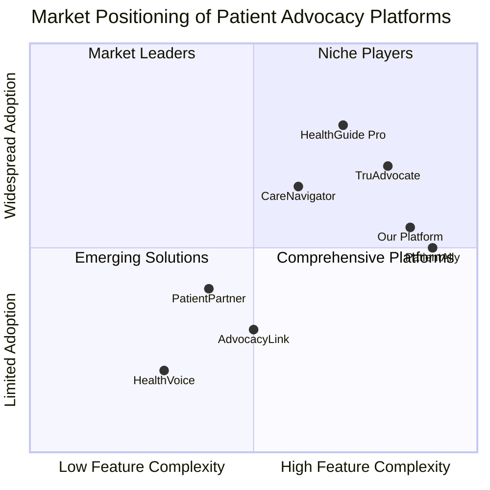

# Competitive Analysis: Patient Advocacy Software Platforms

## Overview

This document provides a comprehensive analysis of existing patient advocacy software platforms as of 2025. Understanding the current market landscape is essential for identifying opportunities, gaps, and competitive advantages for our proposed platform.

## Key Market Players

### TruAdvocate
**Market Position:** Market Leader
**Target Segment:** Large healthcare systems and insurance providers
**Key Strengths:**
- Comprehensive case management
- Strong integration with EHR systems
- Advanced analytics dashboard
- Established market presence

**Key Weaknesses:**
- Expensive pricing model
- Complex implementation process
- Limited personalization options
- Primarily designed for professional advocates rather than patient self-advocacy

### PatientAlly
**Market Position:** Comprehensive Platform
**Target Segment:** Independent patient advocates and advocacy organizations
**Key Strengths:**
- User-friendly interface
- Strong communication tools
- Good documentation management
- Flexible workflow configuration

**Key Weaknesses:**
- Limited AI capabilities
- Weaker insurance navigation tools
- Minimal research integration
- Less robust data analytics
