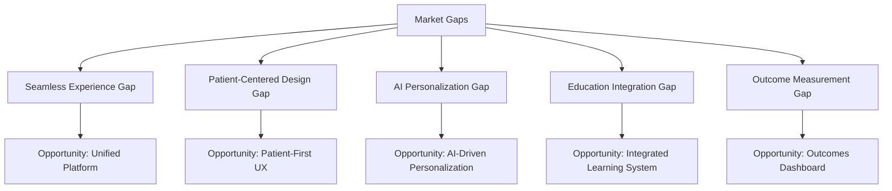

# Competitive Analysis: Patient Advocacy Software Platforms (Continued)

## Key Market Players (Continued)

### HealthGuide Pro
**Market Position:** Market Leader
**Target Segment:** Hospital systems and large clinics
**Key Strengths:**
- Robust integration ecosystem
- Strong compliance features
- Comprehensive training resources
- Advanced reporting capabilities

**Key Weaknesses:**
- Outdated user interface
- Minimal mobile optimization
- Lacking in patient-facing features
- Complex pricing structure

### AdvocacyLink
**Market Position:** Emerging Solution
**Target Segment:** Nonprofit advocacy organizations
**Key Strengths:**
- Affordable pricing
- Good community-building features
- Strong policy tracking tools
- Simple implementation process

**Key Weaknesses:**
- Limited case management capabilities
- Basic document handling
- Few integration options
- Minimal customization capabilities

## Market Trends and Gaps

### Current Trends

1. **Consolidation**: Larger healthcare IT companies acquiring specialized advocacy platforms
2. **AI Integration**: Increasing incorporation of AI for workflow automation and insights
3. **Mobile-First Design**: Shift toward mobile-optimized experiences
4. **Telehealth Integration**: Tighter coupling between advocacy and telehealth platforms
5. **Patient Portal Expansion**: Traditional patient portals expanding into advocacy features

### Key Market Gaps

1. **Seamless Experience**: Most platforms still require multiple systems for complete advocacy
2. **Patient-Centered Design**: Many platforms primarily designed for professional advocates
3. **AI-Powered Personalization**: Limited application of AI for truly personalized advocacy
4. **Education Integration**: Weak connection between advocacy and patient education
5. **Outcome Measurement**: Few platforms effectively measure advocacy impact on outcomes

