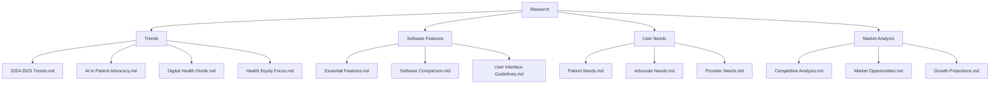

# Patient Advocacy Platform - Research

This directory contains comprehensive research on patient advocacy trends, software features, user needs, and market analysis to inform the development of our patient advocacy platform.

## Directory Structure

## Research Methodology

Our research incorporates the latest data from:
- Industry reports and publications
- Healthcare technology conferences
- Patient advocacy organizations
- Academic research
- Expert interviews
- Market analysis of existing solutions

All research is current as of April 2025, providing the most up-to-date insights into patient advocacy trends and technology requirements.

## Key Research Questions Addressed

1. What are the emerging trends in patient advocacy for 2024-2025?
2. What features are essential for a successful patient advocacy software platform?
3. What are the specific needs of patients, advocates, and healthcare providers?
4. What is the current market landscape for patient advocacy software?
5. How can technology address the challenges in patient advocacy?

## Using This Research

The research contained in this directory serves as the foundation for the development plan and operational strategy of our patient advocacy platform. Each document provides detailed insights and recommendations for specific aspects of the platform.

---

*Last Updated: April 3, 2025*
