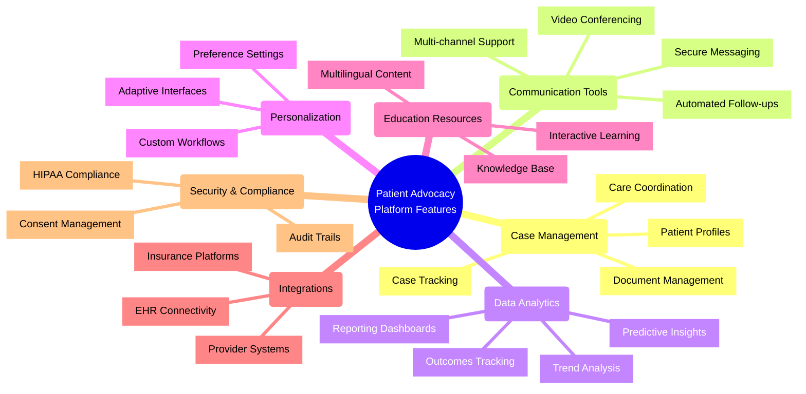

# Essential Features for Patient Advocacy Software Platform (2024-2025)

## Overview

This document outlines the critical features required for an effective patient advocacy software platform in 2024-2025. Based on comprehensive research of current trends, user needs, and technological capabilities, these features represent the foundation for a successful platform.

## 1. Case Management

Comprehensive case management is the core of any patient advocacy platform:

### Patient Profiles
- **Complete Health History**: Secure storage of medical history, conditions, medications, and allergies
- **Preference Tracking**: Recording communication preferences, language needs, and accessibility requirements
- **Support Network**: Documentation of family members, caregivers, and other support contacts
- **Custom Fields**: Configurable fields for unique patient information relevant to specific conditions

### Case Tracking
- **Case Lifecycle Management**: Tools to track advocacy cases from initiation to resolution
- **Status Updates**: Real-time status tracking and milestone recording
- **Task Assignment**: Ability to assign tasks to different advocacy team members
- **Priority Flagging**: System for identifying high-priority cases requiring immediate attention
