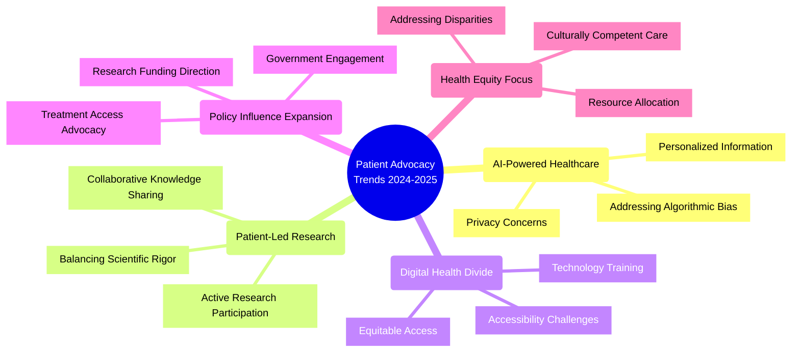

# Patient Advocacy Trends for 2024-2025

## Overview

This document outlines the key trends in patient advocacy for 2024-2025 based on comprehensive research from industry publications, healthcare conferences, and expert analyses.

## 1. AI-Powered Healthcare

Artificial intelligence is revolutionizing healthcare delivery and patient advocacy in 2024-2025. Key developments include:

### Personalized Information
- AI systems now capable of tailoring medical information to individual patient profiles
- Customized treatment plans based on patient data, preferences, and history
- Virtual health assistants that provide personalized guidance

### Privacy Concerns
- Increased focus on data privacy as AI systems process sensitive health data
- Patient control over data becoming a central advocacy issue
- Push for transparent AI systems that respect patient confidentiality

### Addressing Algorithmic Bias
- Recognition of bias in AI systems trained on limited demographic data
- Advocacy for diverse training datasets to ensure equitable care
- Monitoring of AI outcomes across different populations

### Advocacy Role in AI
- Collaboration with policymakers on data privacy regulations
- Education of patients about their rights regarding AI-driven healthcare
- Promotion of ethical AI development in healthcare settings

## 2. Patient-Led Research

Patient participation in research is moving beyond traditional roles into active leadership positions:

### Active Research Participation
- Patients now serving as researchers, study designers, and data collectors
- Patient-initiated research questions becoming more common
- Shift from subjects to partners in research design and implementation

### Collaborative Knowledge Sharing
- Platforms like "Count Me In" enabling patient data pooling for faster insights
- Social media facilitating patient collaboration on research projects
- Metastatic Breast Cancer Project demonstrating successful patient-led initiatives

### Balancing Scientific Rigor
- Development of standards for patient-led research methodologies
- Partnerships between patients and academic institutions to ensure quality
- New models for peer review that incorporate patient perspectives

### Advocacy Role in Research
- Forging partnerships with academic institutions and research bodies
- Developing best practices for ethical patient-led research
- Promoting recognition of patient contributions to scientific progress
