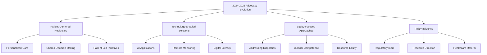

# Patient Advocacy Trends for 2024-2025 (Final Section)

## 5. A Stronger Focus on Health Equity

Health equity has become a cornerstone of patient advocacy in 2024-2025:

### Addressing Disparities
- Targeted initiatives to address health disparities in marginalized communities
- Recognition of social determinants of health in advocacy work
- Data collection to identify and address systemic inequities

### Culturally Competent Care
- Push for culturally appropriate healthcare delivery
- Inclusion of diverse perspectives in treatment planning
- Training programs for healthcare providers on cultural competence

### Resource Allocation
- Advocacy for equitable distribution of healthcare resources
- Focus on underserved communities and conditions
- Transparent metrics for measuring equity improvements

### Advocacy Role in Health Equity
- Ensuring marginalized communities' voices are heard
- Advocating for equitable resource allocation
- Holding healthcare institutions accountable for addressing disparities

## 6. Personalized Advocacy Approaches

Tailoring advocacy to individual patient needs has become increasingly important:

### Individualized Support
- Customized advocacy plans based on patient preferences and needs
- Recognition that one-size-fits-all approaches are insufficient
- Technology enabling personalized advocacy at scale

### Patient-Centered Communication
- Adapting communication styles to individual preferences
- Multi-channel engagement strategies
- Information delivery customized to health literacy levels

### Targeted Interventions
- Focus on specific needs of different patient populations
- Custom advocacy tools for various conditions and demographics
- Personalized follow-up and support mechanisms

## 7. Community and Collective Support

The power of community continues to drive effective advocacy:

### Collaborative Networks
- Growing importance of patient communities in advocacy work
- Shared decision-making and collective action
- Strength in numbers approach to policy influence

### Peer Support Integration
- Formal integration of peer support into advocacy programs
- Training for peer advocates to provide evidence-based support
- Technology platforms enabling peer connections

### Advocacy Empowerment
- Focus on building leadership skills within patient communities
- Training programs for effective advocacy techniques
- Recognition and certification of patient advocates

## Looking Ahead: Building a More Inclusive, Patient-Centered Future

As we move through 2025 and beyond, patient advocacy will continue to evolve with technology advances, policy changes, and growing recognition of patients as essential partners in healthcare. The goal remains clear: fostering a healthcare system where every patient is seen, heard, and empowered to help shape the future of their care.

---

*Sources:*
1. *Powerful Patients - The Future of Patient Advocacy: 5 Key Trends for 2025 and Beyond*
2. *BioLaunch Solutions - Patient Advocacy Trends to Expect in 2025 and Beyond*
3. *Social Health Network - Predicting Advocacy Trends for 2025*
4. *Healthcare industry conferences and publications, 2024-2025*
