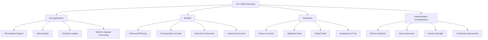

# AI in Patient Advocacy (2024-2025)

## Overview

Artificial intelligence (AI) has emerged as a transformative force in patient advocacy during 2024-2025. This document explores the specific applications, benefits, challenges, and implementation considerations for AI in patient advocacy platforms.

## Key Applications

### Personalized Support

AI algorithms are now capable of analyzing individual patient data to provide customized advocacy and support:

- **Tailored Information Delivery**: AI systems deliver medical information customized to the patient's condition, demographics, and preferences
- **Personalized Action Plans**: Generation of advocacy plans specific to each patient's healthcare journey and needs
- **Adaptive Interfaces**: User interfaces that adjust based on patient preferences, health literacy, and accessibility needs

### Data Analysis and Pattern Recognition

AI excels at processing large datasets to identify patterns that human advocates might miss:

- **Population Health Insights**: Identification of trends across patient populations to guide advocacy priorities
- **Resource Allocation**: Data-driven recommendations for focusing advocacy efforts where they will have the greatest impact
- **Treatment Response Analysis**: Analysis of how different patient groups respond to treatments to inform advocacy for personalized medicine
