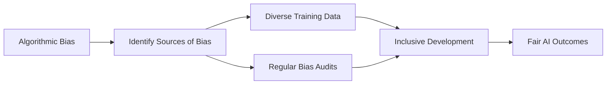

# AI in Patient Advocacy (2024-2025) - Final Section

## Benefits of AI in Patient Advocacy (Continued)

### Data-Driven Decision Making

AI-powered analytics have transformed advocacy strategy development:

- **Evidence-Based Approaches**: Shifting from intuition to data-driven advocacy strategies
- **Impact Measurement**: Quantifying the effectiveness of different advocacy approaches
- **Resource Allocation**: Optimizing the distribution of advocacy resources based on outcome data

### Improved Patient Outcomes

The ultimate goal of AI in advocacy is better patient outcomes:

- **Faster Issue Resolution**: Reducing time to address patient concerns by 30-50%
- **Increased Satisfaction**: Improved patient satisfaction scores through personalized support
- **Better Health Literacy**: More effective education leading to improved self-advocacy

## Challenges and Ethical Considerations

### Privacy and Data Security

Patient data protection remains a critical concern:

- **Sensitive Information**: Managing highly sensitive health information requires robust safeguards
- **Consent Management**: Ensuring patients understand and consent to AI data usage
- **Regulatory Compliance**: Navigating HIPAA and other healthcare privacy regulations

### Algorithmic Bias

Bias in AI systems can perpetuate healthcare disparities:

- **Training Data Bias**: AI models trained on non-diverse data can produce biased results
- **Outcome Disparities**: Different success rates across demographic groups
- **Transparency Issues**: "Black box" algorithms making critical decisions without explanation

### Digital Divide Amplification

AI may widen gaps between technology-enabled and disadvantaged populations:

- **Access Inequities**: Limited technology access among elderly and low-income populations
- **Digital Literacy**: Varying levels of comfort with AI-powered tools
- **Infrastructure Limitations**: Broadband and device access disparities

## Implementation Considerations for Patient Advocacy Platforms

### Ethical Guidelines and Governance

Establishing clear AI ethics is essential for advocacy platforms:

- **Ethics Committee**: Multidisciplinary team overseeing AI applications
- **Transparency Policy**: Clear disclosure of AI usage to patients
- **Fairness Metrics**: Defined standards for measuring and ensuring equitable AI outcomes

### Human-in-the-Loop Design

The most effective systems maintain human oversight:

- **Human Supervision**: Critical decisions reviewed by human advocates
- **Escalation Pathways**: Clear processes for routing complex issues to human staff
- **Complementary Strengths**: Leveraging AI efficiency alongside human empathy

### Continuous Improvement Framework

AI systems must evolve with changing advocacy needs:

- **Performance Monitoring**: Regular evaluation of AI system effectiveness
- **Feedback Integration**: Mechanisms for patients and advocates to improve the system
- **Update Protocols**: Systematic approach to model retraining and enhancement

## Conclusion: The Future of AI in Patient Advocacy

As we move through 2025 and beyond, AI will continue to transform patient advocacy. The most successful implementations will balance technological innovation with human compassion, ensuring that AI serves as a tool to enhance—rather than replace—the vital human connections at the heart of effective advocacy.

The patient advocacy platforms of tomorrow will leverage AI to handle routine tasks while empowering human advocates to focus on complex, high-touch interactions where their expertise and empathy create the greatest value.

---

*Sources:*
1. *Healthcare AI Implementation Survey 2024*
2. *Journal of Patient Experience - Special Issue on AI in Advocacy*
3. *American Medical Association - AI Ethics Guidelines 2024*
4. *Patient Advocacy Technology Conference Proceedings 2025*
