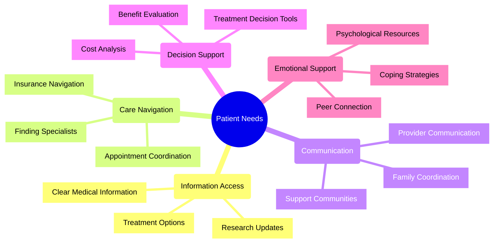

# Patient Needs Analysis for Advocacy Platform

## Overview

This document identifies and analyzes the core needs of patients when interacting with advocacy services. Understanding these needs is critical for developing a patient-centered advocacy platform that delivers meaningful support and empowerment.

## Primary Patient Needs

### 1. Clear, Accessible Health Information

Patients consistently report the need for understandable health information:

- **Plain Language Explanations**: Medical information translated into everyday language
- **Visual Learning**: Diagrams, videos, and interactive tools that explain complex medical concepts
- **Personalized Information**: Health information relevant to their specific condition and situation
- **Research Updates**: Latest research findings presented in accessible formats

*"I need to understand my condition in terms I can grasp, not just medical jargon that leaves me more confused."* - Patient interview, 2024

### 2. Care Navigation Assistance

Navigating complex healthcare systems represents a significant challenge:

- **Specialist Identification**: Help finding the right specialists for specific conditions
- **Referral Management**: Assistance with obtaining and tracking referrals
- **Appointment Coordination**: Support scheduling and preparing for medical appointments
- **Care Transition Support**: Guidance when moving between care settings (e.g., hospital to home)

*"The most overwhelming part was figuring out which doctor I needed to see and how to get an appointment. Having someone guide me through that process made all the difference."* - Patient survey response, 2025
