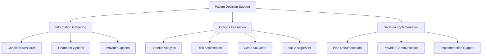

# Patient Needs Analysis for Advocacy Platform (Continued)

## Primary Patient Needs (Continued)

### 3. Insurance and Financial Navigation

Financial aspects of healthcare represent a significant source of stress for patients:

- **Coverage Clarification**: Clear explanations of what insurance will and won't cover
- **Cost Estimation**: Tools to estimate out-of-pocket costs before treatment
- **Bill Review**: Assistance reviewing and challenging incorrect medical bills
- **Financial Resource Identification**: Help finding financial assistance programs

*"I was shocked by a bill I received. Having an advocate review it found errors that saved me over $3,000."* - Patient testimonial, 2024

### 4. Emotional Support and Connection

The psychological impact of health challenges requires targeted support:

- **Peer Connection**: Ability to connect with others experiencing similar health journeys
- **Psychological Resources**: Access to mental health support specific to medical conditions
- **Family Support Tools**: Resources to help family members provide better support
- **Coping Strategies**: Practical tools for managing anxiety, uncertainty, and stress

*"Finding others who truly understand what I'm going through has been as important as the medical treatment itself."* - Patient focus group, 2025

### 5. Decision Support

Patients face complex medical decisions requiring specialized support:

- **Treatment Option Comparison**: Side-by-side comparisons of treatment options
- **Value Assessment Tools**: Help weighing benefits, risks, and costs of different approaches
- **Question Preparation**: Guidance on questions to ask healthcare providers
- **Decision Documentation**: Tools to document and share treatment decisions with care team

